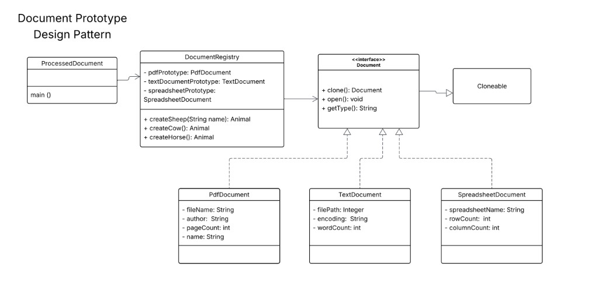

# Document Prototype Design Pattern

This project implements the **Prototype Design Pattern** in Java. It allows for the creation of new document objects by cloning existing prototypes, which is particularly useful for avoiding the overhead of complex object creation or repeated initialization.

## Architecture

The system follows the structure defined in the provided UML class diagram:



### Key Components
- **Document (Interface):** Defines the `clone()`, `open()`, and `getType()` methods. It extends the standard Java `Cloneable` interface.
- **Concrete Prototypes:** - `PdfDocument`: Manages PDF-specific metadata.
    - `TextDocument`: Manages file paths and encoding settings.
    - `SpreadsheetDocument`: Manages row/column counts and sheet names.
- **DocumentRegistry:** A registry that initializes one instance of each document type in its constructor and returns clones via the `getDocument(String type)` method.
- **ProcessedDocument:** The client entry point (main class) that demonstrates the cloning and customization workflow.

## How to Run
1. Ensure all `.java` files are in the same directory.
2. Compile the classes:
   ```bash
   javac *.java
